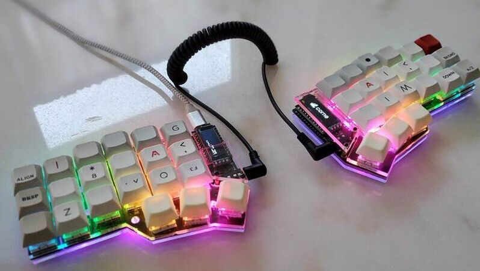

Like most hobbies, and specifically the mechanical keyboard hobby, you can't stop at just one. This radical keyboard supports RGB LED SMDs. This entire board features SMD mounted everything! The diodes and resistors and LEDs are all SMDs. This makes its very difficult to build and super thin!.

Thin and ergonomic is what I was going for with this board. The lights are awesome! The OLED displays are just keyboard bling. Meaning, you don't need them, but if you can have them, why not! I cut out the top and bottom acrylic plates using a Epilog Fusion M2 Laser cutter. There's a little bit of black magic getting the settings just right. You have four essential settings apart from calibrating the Laser bed and position. DPI which is the resolution, power, frequency and speed. 